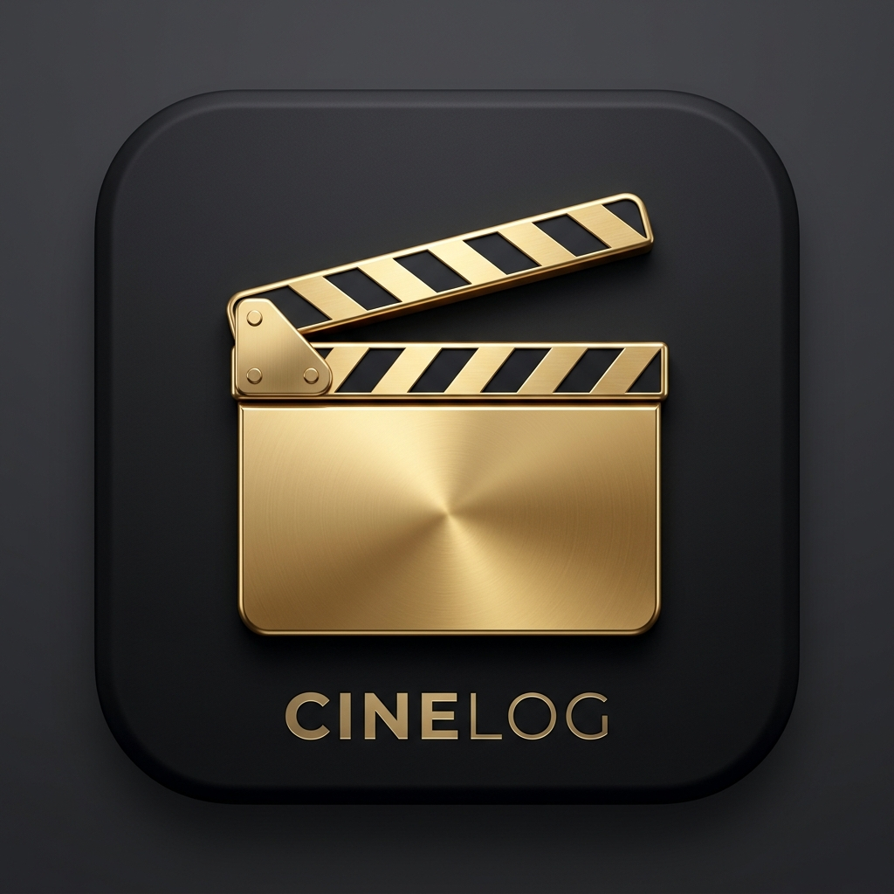

#  CineLog - Your Ultimate Movie Journal

[](https://kotlinlang.org)
[](https://developer.android.com)
[](https://deepmind.google/technologies/gemini/)
[](https://www.themoviedb.org/)
[](https://firebase.google.com/docs/auth)

---

## 👤 Penulis

| Keterangan | Detail |
| :--- | :--- |
| **Nama** | Nada Senaider |
| **NIM** | 312410677 |
| **Kelas** | I24.2A |
| **Nama Aplikasi** | CineLog |
| **Mata Kuliah** | Pemrograman Mobile 2 |
| **Dosen Pengampu** | Donny Maulana, S.Kom., M.M.S.I. |

---

**CineLog** adalah aplikasi jurnal film modern yang dirancang untuk membantu pecinta sinema melacak tontonan mereka, menemukan judul baru, dan berinteraksi dengan asisten pintar berbasis kecerdasan buatan. Proyek ini dibuat sebagai syarat penyelesaian tugas mata kuliah **Pemrograman Mobile 2**.


---

## 🚀 Fitur Utama

Aplikasi CineLog hadir dengan berbagai fitur premium:

*   **🤖 CineLog AI Assistant**: Rekomendasi film personal yang ditenagai oleh **Google Gemini 2.5 Flash**. Ngobrol dengan AI untuk menemukan tontonan yang paling cocok buat kamu.
*   **🌍 Pencarian Luas (TMDB)**: Terintegrasi dengan database *The Movie Database (TMDB)* untuk memberikan informasi film dan serial TV paling update dari seluruh dunia.
*   **📑 Koleksi Pribadi**: Kelola tontonanmu ke dalam kategori **Watchlist** (Akan Ditonton), **Watched** (Sudah Ditonton), dan **Favorite**.
*   **📊 Statistik Tontonan**: Lihat ringkasan aktivitas menontonmu, termasuk total durasi waktu tonton dan statistik ulasan per kategori.
*   **🎞️ Multi-Kategori**: Khusus buat kamu pecinta **Anime** dan **K-Drama**, CineLog menyediakan filter khusus untuk memudahkan pencarian.
*   **🔐 Google Authentication**: Akses praktis dan aman menggunakan akun Google pribadi.

---

## 🛠️ Stack Teknologi


Proyek ini dibangun menggunakan standar pengembangan Android modern:

*   **Bahasa Pemrograman**: [Kotlin](https://kotlinlang.org/)
*   **Arsitektur**: MVVM (Model-View-ViewModel)
*   **UI Framework**: Android ViewBinding & XML Layouts
*   **Storage (Local DB)**: [Room Persistence](https://developer.android.com/training/data-storage/room)
*   **Networking**: [Retrofit 2](https://square.github.io/retrofit/) & OkHttp 3
*   **Movie Database**: [TMDB API](https://www.themoviedb.org/documentation/api)
*   **AI Engine**: [Google Generative AI SDK](https://ai.google.dev/) (Gemini API)
*   **Image Loading**: [Glide](https://github.com/bumptech/glide)
*   **Firebase**: Analytics
*   **Authentication**: [Google Sign-In](https://developers.google.com/identity/sign-in/android)

---

## ⚙️ Persiapan & Instalasi

Jika Anda ingin menjalankan proyek ini secara lokal:

1.  **Clone Repository**
    ```bash
    git clone https://github.com/username/CineLog.git
    ```
2.  **Siapkan API Key**
    *   Buka file `app/src/main/java/com/example/cinelog/utils/Constants.kt`.
    *   Pastikan `TMDB_API_KEY` dan `GEMINI_API_KEY` sudah terisi dengan benar.
3.  **Build Project**
    *   Buka di Android Studio (Koala ke atas direkomendasikan).
    *   Sync Gradle dan jalankan di Emulator atau Perangkat Fisik.


---

Copyright © 2026 **CineLog**. Built with ❤️ for movie lovers.
